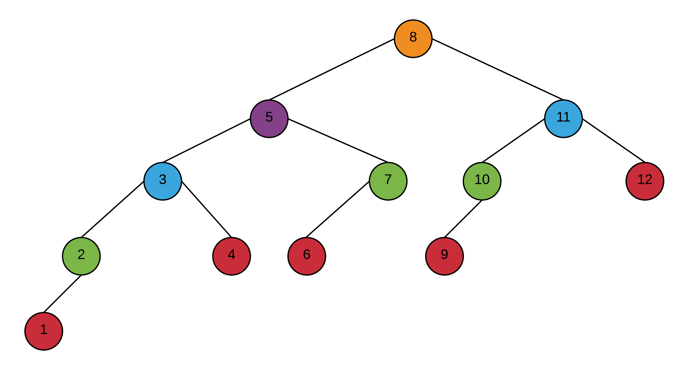
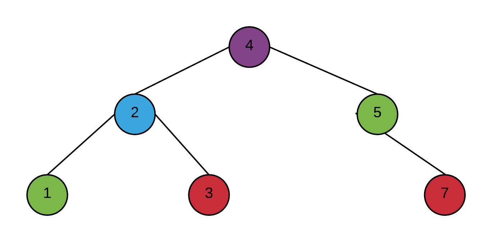
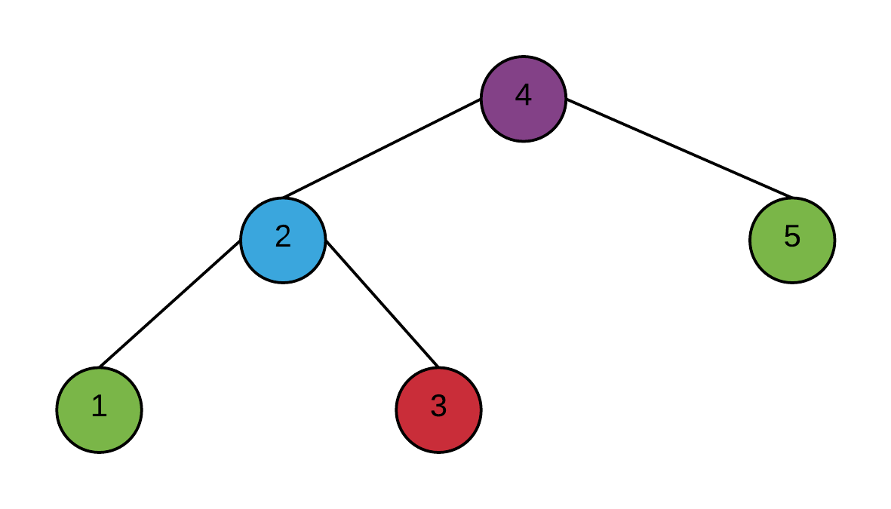

# 2 Arbres binaires de recherche

## 2.2 Arbre AVL minimal

suite de Fibonnaci
n(h) = {
  0 si h = 0
  1 si h = 1
  n(h - 1) + n(h - 2) + 1 si h >= 2
}

n(0) = 0

n(1) = 1

n(2) = n(1) + n(0) + 1 = 1 + 0 + 1 = 2

n(3) = n(2) + n(1) + 1 = 2 + 1 + 1 = 4

n(4) = n(3) + n(2) + 1 = 4 + 2 + 1 = 7

n(5) = n(4) + n(3) + 1 = 7 + 4 + 1 = 12

## 2.3 Insertion

## 2.4 Suppression

