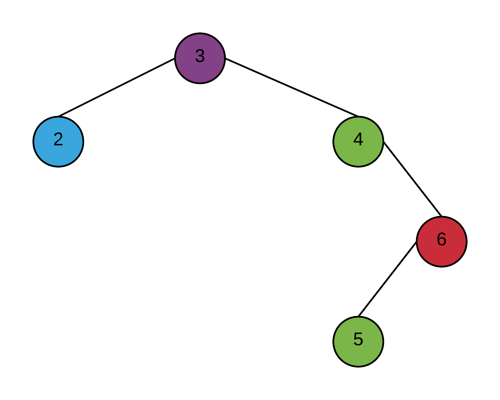
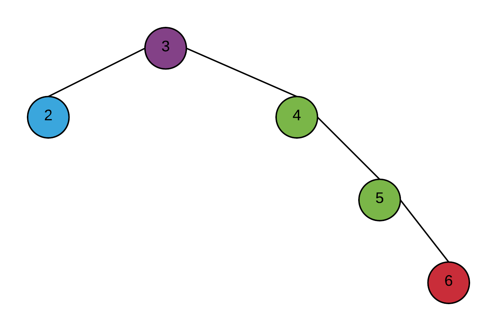
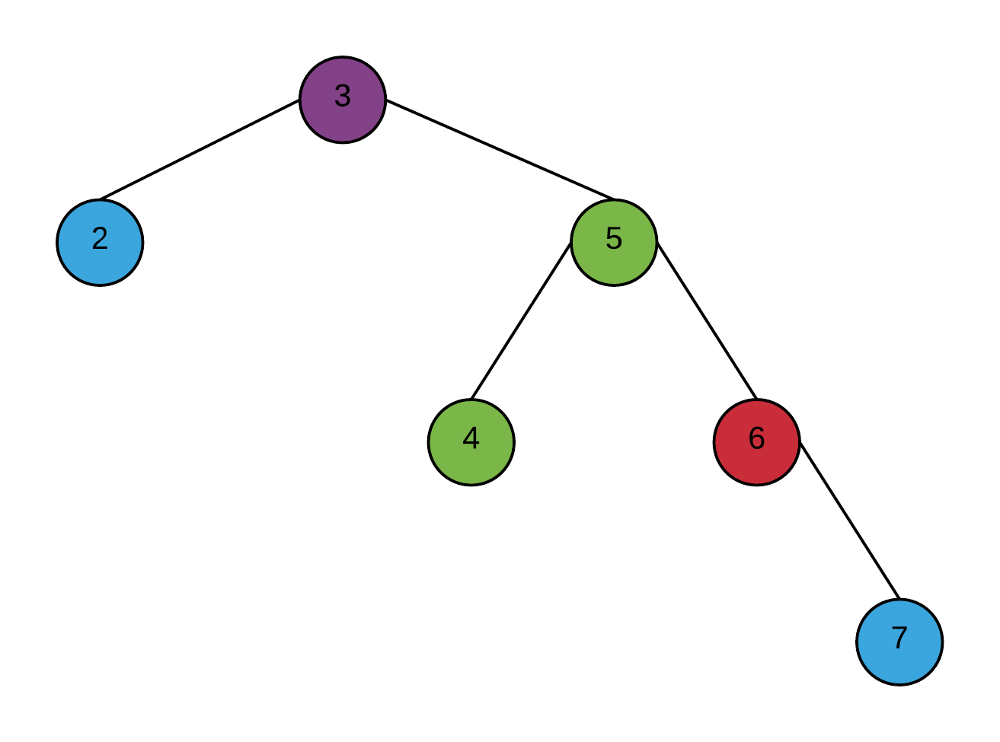
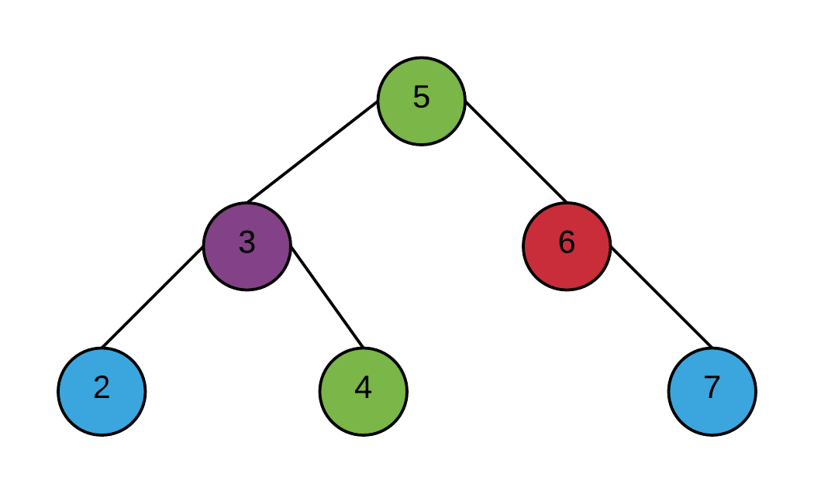
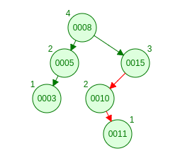
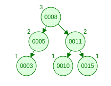

# 3 Arbres AVL

## (a)

## (b)

### Double rotation

## (d)
Non

n(7) = 32

n(8) = 53

n(9) = n(8) + n(7) + 1 = 53 + 32 + 1 = 96

C'est impossible car un des cotés de la racine aura au moins 32 éléments.

## (e)
33 à (100 - 32)
33 à 68
