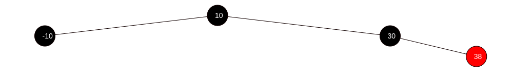

# Arbre rouge-noir - Suppression

## Cas 4
Supprimer 20 de l'arbre rouge-noir suivant.

**Avant**

**Après**

## Cas 6
Supprimer -10 de l'arbre rouge-noir suivant.

**Avant**

**Après**

## Cas 3 + Cas 1
Supprimer -10 de l'arbre rouge-noir suivant.

**Avant**

**Après**

